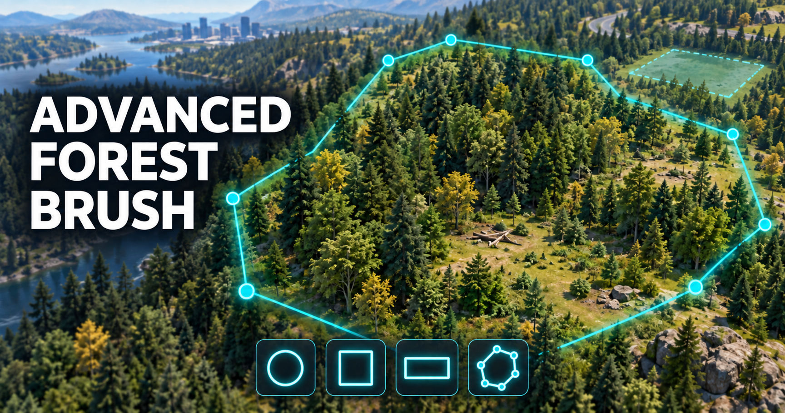

# Advanced Forest Brush

Advanced Forest Brush expands vegetation placement in Cities: Skylines II

  

## Brush shapes

- Circle with adjustable brush size
- Square with adjustable size and rotation
- Rectangle with separate width, length and rotation controls
- Multi-point polygon with an unlimited number of corner points

## Distribution modes

- Uniform
- Natural
- Clusters
- Clearings
- Forest edge

Noise size and irregularity can be adjusted for all non-uniform distribution modes. Brush density can be set from 10% to 300%.

## Tree ages

Advanced Forest Brush uses the Tree Controller age selection

## Features

- Configurable noise size and irregularity
- Movable and rotatable completed polygons
- Species Grouping – Places selected tree species in natural-looking patches
- Support for the game and editor
- English, German, Spanish, Italian, French localization

## How to use

1. Open the vegetation or tree placement tool.
2. Select a tree or vegetation asset.
3. Open Advanced Forest Brush using its button in the tool interface.
4. Select the desired brush shape.
5. Adjust size, density, distribution and tree ages.
6. Place vegetation with the left mouse button.

For a polygon:

1. Select the multi-point polygon shape.
2. Left-click to place each corner point.
3. Click the first point or double-click to close the polygon.
4. Move the completed polygon to the desired position.
5. Hold ctrl + right mouse button and move horizontally to rotate the completed polygon.
6. Left-click to place vegetation inside the polygon.
7. Press Esc or use **Reset polygon** to start a new polygon.

## Compatibility

Advanced Forest Brush works with the normal vegetation placement tool and integrates with [Tree Controller](https://github.com/yenyang/Tree_Controller) by yenyang for tree-age selection.

## Bug reports

When reporting a problem, please include:

- A description of the problem
- The selected brush shape and distribution mode
- Steps to reproduce the issue

## Transparency note

Some parts of the code and user interface were created with AI assistance. AI is also used for debugging and troubleshooting.

## Changes

### Version 0.7.0

- Initial Release

## License notes

The project is an independent companion. Concepts and API patterns were studied from Tree Controller, which is MIT licensed. No Tree Controller source files are redistributed in this archive.
